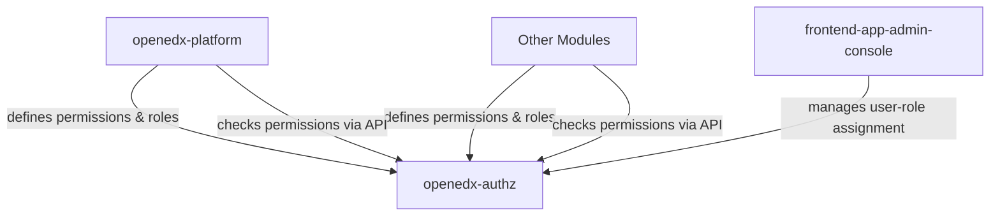

# The Future of Roles & Permissions in Open&nbsp;edX<sup>®</sup>

A Developer’s Guide to the New RBAC AuthZ System.

**Rodrigo Mendez** - Staff Software Engineer @ **WGU**

<div class="absolute bottom-32 right-8 flex flex-col items-end justify-end gap-4">
  
  
</div>


---
layout: two-cols
---

# Rodrigo Mendez

Staff Software Engineer

I'm a **software engineer**, hardware hobbyist and industrial design aficionado from Mexico.

I've been working with **Open edX** at **WGU** for over three years, where I've gained first-hand insight into the needs that large organizations have to better serve students.

I'm currently contributing to the Open edX project as a **Core Contributor** and maintainer of **openedx-authz**.

I've been tinkering with **Open Source Software** since **2006**.

::right::

<div class="flex flex-col items-center justify-center h-full">
  
  <div class="flex flex-col gap-1 mt-4">
    <a href="https://github.com/rodmgwgu" target="_blank" class="flex items-center gap-2 text-sm">
      <carbon-logo-github /> rodmgwgu
    </a>
    <a href="https://github.com/rodmg" target="_blank" class="flex items-center gap-2 text-sm">
      <carbon-logo-github /> rodmg
    </a>
    <a href="https://www.linkedin.com/in/rodrigo-méndez-gamboa-5173a0164/" target="_blank" class="flex items-center gap-2 text-sm">
      <carbon-logo-linkedin /> rodrigo-méndez-gamboa
    </a>
  </div>
</div>

---
layout: two-cols
---

# A real use case
At WGU

<div v-click class="flex items-center gap-4 mb-5">
<carbon-edit class="text-blue-950 font-size-2xl flex-shrink-0" />
<span>PDev team in charge of <b>course authoring</b></span>
</div>

<div v-click class="flex items-center gap-4 mb-5">
<carbon-group class="text-blue-950 font-size-2xl flex-shrink-0" />
<span>Several <b>hundred authors</b></span>
</div>

<div v-click class="flex items-center gap-4 mb-5">
<carbon-book class="text-blue-950 font-size-2xl flex-shrink-0" />
<span>Over <b>1000 active courses</b></span>
</div>

<div v-click class="flex items-center gap-4 mb-5">
<carbon-user-role class="text-blue-950 font-size-2xl flex-shrink-0" />
<span>Authors are <b>assigned to specific courses</b></span>
</div>

<div v-click class="flex items-center gap-4">
<carbon-view-off class="text-blue-950 font-size-2xl flex-shrink-0" />
<span>They shouldn't modify other courses, but need to <b>see content as reference</b></span>
</div>

::right::

<div class="flex items-center justify-center h-full">

</div>

---
layout: two-cols
---

# The Problem

<div v-click class="flex items-center gap-3 mb-5">
<carbon-settings-adjust class="text-[#9D0054] font-size-2xl flex-shrink-0" />
<span>Not enough <b>granularity</b> — either full edit access, or nothing at all</span>
</div>

<div v-click class="flex items-center gap-3 mb-5">
<carbon-locked class="text-[#9D0054] font-size-2xl flex-shrink-0" />
<span>Roles are <b>hardcoded</b> — can't be customized or extended</span>
</div>

<div v-click class="flex items-center gap-3 mb-5">
<carbon-code class="text-[#9D0054] font-size-2xl flex-shrink-0" />
<span>Permissions are <b>implementation-specific</b> — no shared standard</span>
</div>

<div v-click class="flex items-center gap-3 mb-5">
<carbon-warning class="text-[#9D0054] font-size-2xl flex-shrink-0" />
<span><b>No single authorization method</b> across Open edX</span>
</div>

::right::

<div class="flex items-center justify-center h-full">

</div>

---
layout: two-cols
---

# The Problem

No single authorization method in Open edX

<div v-click class="flex items-center gap-3 mb-5">
<carbon-cube class="text-[#9D0054] font-size-2xl flex-shrink-0" />
<span><b>Libraries V2</b> — Custom model-based system (pre Ulmo)</span>
</div>

<div v-click class="flex items-center gap-3 mb-5">
<carbon-edit class="text-[#9D0054] font-size-2xl flex-shrink-0" />
<span><b>Course Authoring</b> — A different model-based system</span>
</div>

<div v-click class="flex items-center gap-3">
<carbon-application class="text-[#9D0054] font-size-2xl flex-shrink-0" />
<span><b>LMS, Django, Forums</b> — and more, each with their own approach</span>
</div>

::right::

<div class="flex items-center justify-center h-full">

</div>

---
layout: two-cols
---

# The Solution

<div v-click class="flex items-center gap-3 mb-5">
<carbon-checkmark-outline class="text-[#00BBF9] font-size-2xl flex-shrink-0" />
<span>A <b>standard authorization system</b> across the entire platform</span>
</div>

<div v-click class="flex items-center gap-3 mb-5">
<carbon-user-admin class="text-[#00BBF9] font-size-2xl flex-shrink-0" />
<span>Permissions that are <b>simple to understand and manage</b></span>
</div>

<div v-click class="flex items-center gap-3 mb-5">
<carbon-center-circle class="text-[#00BBF9] font-size-2xl flex-shrink-0" />
<span>A <b>central place</b> to define and control all permissions</span>
</div>

<div v-click class="flex items-center gap-3 mb-5">
<carbon-unlink class="text-[#00BBF9] font-size-2xl flex-shrink-0" />
<span><b>Decouple permissions from code</b> — no more hardcoded logic</span>
</div>

::right::

<div class="flex items-center justify-center h-full">

</div>

---
layout: two-cols-header
---

# RBAC as the authorization method
Role Based Access Control

::left::

<div v-click class="flex items-center gap-3 mb-5">
<carbon-group-objects class="text-[#00BBF9] font-size-2xl flex-shrink-0" />
<span>Groups <b>granular permissions</b> into roles</span>
</div>

<div v-click class="flex items-center gap-3 mb-5">
<carbon-user-role class="text-[#00BBF9] font-size-2xl flex-shrink-0" />
<span>A <b>user is assigned a role</b>, a role holds a collection of permissions</span>
</div>

<div v-click class="flex items-center gap-3 mb-5">
<carbon-list-checked class="text-[#00BBF9] font-size-2xl flex-shrink-0" />
<span>Permissions are <b>fine-grained</b> — <i>view course</i>, <i>edit course</i>, <i>delete course</i></span>
</div>

<div v-click class="flex items-center gap-3">
<carbon-connect class="text-[#00BBF9] font-size-2xl flex-shrink-0" />
<span>Role assignments are <b>scoped to a resource</b> — a course, a library, or a collection</span>
</div>

::right::

<div class="flex items-center justify-center h-full">

</div>

---

# The RBAC AuthZ Project

<div v-click class="flex items-center gap-3 mb-5">
<carbon-logo-github class="text-[#00BBF9] font-size-2xl flex-shrink-0" />
<span><code>openedx-authz</code> — Library and set of standards for implementing <b>authorization on Open edX platform</b></span>
</div>

<div v-click class="flex items-center gap-3 mb-5">
<carbon-logo-github class="text-[#00BBF9] font-size-2xl flex-shrink-0" />
<span><code>frontend-app-admin-console</code> — Central place to <b>manage role assignments</b></span>
</div>

<br/>

<div v-click v-motion :initial="{ opacity: 0, y: 40 }" :enter="{ opacity: 1, y: 0, transition: { duration: 600 } }">
  <h2> The RBAC Project is a collaboration between </h2>

  <div class="grid grid-cols-4 gap-4 mt-4 items-center justify-center">
    
    
    
    
  </div>
</div>

---

# The team

<div class="grid grid-cols-5 gap-4 mt-4">
  <div class="flex flex-col items-center">
    
    <span class="text-xs mt-1">mariajgrimaldi</span>
  </div>
  <div class="flex flex-col items-center">
    
    <span class="text-xs mt-1">MaferMazu</span>
  </div>
  <div class="flex flex-col items-center">
    
    <span class="text-xs mt-1">BryanttV</span>
  </div>
  <div class="flex flex-col items-center">
    
    <span class="text-xs mt-1">Guillermo Viedma</span>
  </div>
  <div class="flex flex-col items-center">
    
    <span class="text-xs mt-1">María de los Ángeles</span>
  </div>
  <div class="flex flex-col items-center">
    
    <span class="text-xs mt-1">bmtcril</span>
  </div>
  <div class="flex flex-col items-center">
    
    <span class="text-xs mt-1">rodmgwgu</span>
  </div>
  <div class="flex flex-col items-center">
    
    <span class="text-xs mt-1">wgu-taylor-payne</span>
  </div>
  <div class="flex flex-col items-center">
    
    <span class="text-xs mt-1">dwong2708</span>
  </div>
  <div class="flex flex-col items-center">
    
    <span class="text-xs mt-1">dcoa</span>
  </div>
  <div class="flex flex-col items-center">
    
    <span class="text-xs mt-1">jacobo-dominguez-wgu</span>
  </div>
  <div class="flex flex-col items-center">
    
    <span class="text-xs mt-1">jesusbalderramawgu</span>
  </div>
  <div class="flex flex-col items-center">
    
    <span class="text-xs mt-1">bra-i-am</span>
  </div>
  <div class="flex flex-col items-center">
    
    <span class="text-xs mt-1">ccantillo</span>
  </div>
</div>

<!--
A truelly world wide team, people from the US, Colombia, Mexico, Argentina, Spain and Australia 
 -->

---
layout: two-cols-header
---

# The RBAC AuthZ Project

::left::

<div v-click="1" class="flex items-center gap-3 mb-5">
<carbon-calendar class="text-[#00BBF9] font-size-2xl flex-shrink-0" />
<span>Started <b>2025</b></span>
</div>

<div v-click="2" class="flex items-center gap-3 mb-5">
<carbon-number-1 class="text-[#00BBF9] font-size-2xl flex-shrink-0" />
<span><b>Phase 1</b> — Content Libraries (Ulmo)</span>
</div>

<div v-click="3" class="flex items-center gap-3 mb-5">
<carbon-number-2 class="text-[#00BBF9] font-size-2xl flex-shrink-0" />
<span><b>Phase 2</b> — Course Authoring (Verawood)</span>
</div>

<div v-click="4" class="flex items-center gap-3">
<carbon-number-3 class="text-[#00BBF9] font-size-2xl flex-shrink-0" />
<span><b>Phase 3</b> — Extensibility and new roles</span>
</div>

::right::

<div class="flex items-center justify-center h-full">
  <v-switch>
    <template #0-2>
      
    </template>
    <template #2>
      
    </template>
    <template #3>
      
    </template>
    <template #4>
      
    </template>
  </v-switch>
</div>

---
layout: two-cols-header
---

# Key Decisions

::left::

<div v-click="1" class="flex items-center gap-3 mb-4">
<carbon-unlink class="text-[#00BBF9] font-size-2xl flex-shrink-0" />
<span><b>Decouple</b> roles and permissions from code</span>
</div>

<div v-click="2" class="flex items-center gap-3 mb-4">
<carbon-user-favorite class="text-[#00BBF9] font-size-2xl flex-shrink-0" />
<span>Simple to understand even for <b>non-technical users</b></span>
</div>

<div v-click="3" class="flex items-center gap-3 mb-4">
<carbon-package class="text-[#00BBF9] font-size-2xl flex-shrink-0" />
<span>Single <b>reusable library</b> for the whole platform — <code>openedx-authz</code></span>
</div>

<div v-click="4" class="flex items-center gap-3 mb-4">
<carbon-thumbs-up class="text-[#00BBF9] font-size-2xl flex-shrink-0" />
<span><b>Easy to use</b></span>
</div>

<div v-click="5" class="flex items-center gap-3 mb-4">
<carbon-plug class="text-[#00BBF9] font-size-2xl flex-shrink-0" />
<span>Simple <b>extensibility</b> (WIP)</span>
</div>

<div v-click="6" class="flex items-center gap-3 mb-4">
<carbon-catalog class="text-[#00BBF9] font-size-2xl flex-shrink-0" />
<span><b>Auditability</b> — mechanisms to audit permission assignments and role changes</span>
</div>

<div v-click="7" class="flex items-center gap-3 mb-4">
<carbon-recycle class="text-[#00BBF9] font-size-2xl flex-shrink-0" />
<span>Don't reinvent the wheel — <b>Casbin</b></span>
</div>

::right::

<div class="flex items-center justify-center h-full">
  <v-switch>
    <template #0-7>
      
    </template>
    <template #7>
      
    </template>
  </v-switch>
</div>

<!--
Use industry standard technologies for authz.
 -->

---

<div class="flex items-center gap-4 inline-title"><h1> How it works</h1> <p>- The Admin console</p></div>

<video src="/video/adminconsole.mov" autoplay loop muted class="h-110 rounded-lg mx-auto"></video>

---

<div class="flex items-center gap-4 inline-title"><h1> How it works</h1> <p>- Available Roles</p></div>

<video src="/video/rolesandpermissions.mov" autoplay loop muted class="h-110 rounded-lg mx-auto"></video>

---

<div class="flex items-center gap-4 inline-title"><h1> How it works</h1> <p>- Assigning a Role</p></div>

<video src="/video/assignrole.mov" autoplay loop muted class="h-110 rounded-lg mx-auto"></video>

---
layout: two-cols-header
---

# Main Concepts

::left::

<div class="flex items-center gap-3 mb-4">
<carbon-license class="text-[#00BBF9] font-size-2xl flex-shrink-0" />
<span><b>Permission</b> — A specific allowed action, e.g. <span class="text-[#476480] italic">view library, edit library, delete library</span></span>
</div>

<div class="flex items-center gap-3 mb-4">
<carbon-user-role class="text-[#00BBF9] font-size-2xl flex-shrink-0" />
<span><b>Role</b> — A collection of permissions, e.g. <span class="text-[#476480] italic">Library Admin, Course Staff</span></span>
</div>

<div class="flex items-center gap-3 mb-4">
<carbon-center-circle class="text-[#00BBF9] font-size-2xl flex-shrink-0" />
<span><b>Scope</b> — The object over which a role is applied, e.g. <span class="text-[#476480] italic">a course, a library, an org</span></span>
</div>

<div class="flex items-center gap-3 mb-6">
<carbon-user class="text-[#00BBF9] font-size-2xl flex-shrink-0" />
<span><b>Subject</b> — The <b>user</b> that is assigned a role over a scope</span>
</div>

<div v-click class="flex items-center gap-3 mb-4 pl-4 border-l-3 border-[#00BBF9] mt-8">
<carbon-connect class="text-[#9D0054] font-size-2xl flex-shrink-0" />
<span><b>Role Assignment</b> — A subject is assigned a role for a specific scope</span>
</div>

<div v-click class="flex items-center gap-3 pl-4 border-l-3 border-[#00BBF9]">
<carbon-search class="text-[#9D0054] font-size-2xl flex-shrink-0" />
<span><b>Permission Query</b> — Check if a subject has a specific permission over a scope</span>
</div>

::right::

<div class="flex items-center justify-center h-full">

</div>


<!-- - Create diagram, showing relationships between permissions, roles, and subject-scope thorough an assignation -->

---
layout: section
---

# But wait, where is the code?

<div class="flex items-center justify-center h-100">
  
</div>

---

# openedx-authz

openedx-authz is a library that aims to imlpement the Open edX authorization layer as a single, standard set of APIs and concepts to be used across the platform.

openedx-platform and any other module that wishes to implement granular permissions can define a set of permissions and roles, define those in openedx-authz, and implement the permission checks on their code using the easy-to-use openedx-authz API.

User-role assignment is managed by openedx-authz via frontend-app-admin-console.

---

# openedx-authz relationships



---

# How it works

Backend API - Querying for permissions

````md magic-move {lines: true}
```python
# Minimal Example
from openedx_authz.api import is_user_allowed

# Query for permission
is_allowed = is_user_allowed(
  'some_username',
  'courses.manage_advanced_settings',
  'course-v1:OpenedX+DemoX+DemoCourse'
)

# Returns True if allowed
```

```python
# Using Constants
from openedx_authz.api import is_user_allowed
from openedx_authz.constants.permissions import COURSES_MANAGE_ADVANCED_SETTINGS

# Query for permission
is_allowed = is_user_allowed(
  'some_username',
  COURSES_MANAGE_ADVANCED_SETTINGS.identifier,
  'course-v1:OpenedX+DemoX+DemoCourse'
)

# Returns True if allowed
```

```python
# Real use in openedx-platform
from openedx_authz.api import is_user_allowed
from openedx_authz.constants.permissions import COURSES_MANAGE_ADVANCED_SETTINGS

def check_course_advanced_settings_access(user, course_key, access_type='read'):
  # ...
  if core_toggles.AUTHZ_COURSE_AUTHORING_FLAG.is_enabled(course_key):
    # ...
    return is_user_allowed(user.username, COURSES_MANAGE_ADVANCED_SETTINGS.identifier, str(course_key))
  # Legacy checks go here...
```
````

---

# How it works

Frontend API - Querying for permissions

````md magic-move {lines: true}
```tsx
// Hook to query for logged in user permissions
import { useValidateUserPermissions } from '@src/data/hooks';

// Allows querying for multiple permissions at once
const { data: validatedPermissions } = useValidateUserPermissions([
  {
    action: "courses.manage_advanced_settings",
    scope: "course-v1:OpenedX+DemoX+DemoCourse",
  }
]);

const isAllowed = validatedPermissions[0].allowed;
```
```tsx
// Using constants
import { useValidateUserPermissions } from '@src/data/hooks';
import { CONTENT_COURSE_PERMISSIONS } from '@src/authz-module/constants';

// Allows querying for multiple permissions at once
const { data: validatedPermissions } = useValidateUserPermissions([
  {
    action: CONTENT_COURSE_PERMISSIONS.MANAGE_COURSE_ADVANCED_SETTINGS,
    scope: "course-v1:OpenedX+DemoX+DemoCourse",
  }
]);

const isAllowed = validatedPermissions[0].allowed;
```
````

<!--
The Hook is planned to be moved to frontend-base 
 -->

---

# Available permissions and roles

Reference for developers

<div class="flex gap-18 items-center justify-center h-80">
  <a href="https://openedx.atlassian.net/wiki/spaces/OEPM/pages/5528715266/openedx-authz+permission+list" target="_blank" class="flex flex-col items-center no-underline">
    
    <div class="flex items-center gap-3 mt-2">
      <carbon-wikis class="text-blue-950 font-size-2xl flex-shrink-0" />
      <span class="text-sm"><b>Wiki</b> — Permission list</span>
    </div>
  </a>

  

  <a href="https://github.com/openedx/openedx-authz/blob/main/openedx_authz/engine/config/authz.policy" target="_blank" class="flex flex-col items-center no-underline">
    
    <div class="flex items-center gap-3 mt-2">
      <carbon-logo-github class="text-blue-950 font-size-2xl flex-shrink-0" />
      <span class="text-sm"><code>authz.policy</code></span>
    </div>
  </a>
</div>

---
layout: section
---

# Going Deeper

<div class="flex items-center justify-center h-100">
  
</div>

---

# Casbin

Open-source authorizaton engine

A powerful and efficient open-source access control library that supports multiple authorization models

<div class="flex flex-col items-center justify-center h-100 pb-24">
  
</div>

<!-- - Talk about research and discussion done with the community
  - Talk about avoiding adding extra services -->

---
level: 2
---

# Casbin model

PERM metamodel: Policy, Effect, Request, Matchers

<div class="relative h-8">
  <div v-click-hide="1" class="absolute">Example Casbin model: <b>ACL</b></div>
  <div v-click="1" class="absolute">openedx-authz Casbin model: <b>RBAC</b></div>
</div>

````md magic-move {lines: true}
```ini
[request_definition]
r = sub, obj, act

[policy_definition]
p = sub, obj, act

[policy_effect]
e = some(where (p.eft == allow))

[matchers]
m = r.sub == p.sub && r.obj == p.obj && r.act == p.act

```

```ini
[request_definition]
r = sub, act, scope

[policy_definition]
p = sub, act, scope, eft

[role_definition]
g = _, _, _
g2 = _, _

[policy_effect]
e = some(where (p.eft == allow)) && !some(where (p.eft == deny))

[matchers]
m = is_staff_or_superuser(r.sub, r.act, r.scope) || (g(r.sub, p.sub, r.scope) || g(r.sub, p.sub, "*")) && 
    keyMatch(r.scope, p.scope) && (r.act == p.act || g2(p.act, r.act))
```
````
---
transition: fade
level: 2
---

# Casbin policy

### <carbon-document /> Role definitions

|   | SUBJECT       | ACTION        | SCOPE | EFFECT |
|---|---------------|---------------|-------|--------|
| p | course_admin  | course.create | *     | ALLOW  |
| p | course_admin  | course.delete | *     | ALLOW  |
| p | course_admin  | course.view   | *     | ALLOW  |

### <carbon-data-base /> Role assignments

|   | USERNAME      | ROLE          | SCOPE                          |
|---|---------------|---------------|--------------------------------|
| g | johndoe       | course_admin  | course-v1:OpenedX+DemoX+2026   |
| g | aleidacortez  | course_admin  | course-v1:OpenedX+*            |

<!--
Casbin policies can be stored on file or DB

Currently, p role definitions are stored in a file on openedx-authz.

g (role assignations), are stored on DB
-->

---
level: 2
---

# Casbin policy

### <carbon-data-base /> Role definition and assignments at runtime

|   | V0            | V1            | V2                             | V3    |
|---|---------------|---------------|--------------------------------|-------|
| p | course_admin  | course.create | *                              | ALLOW |
| p | course_admin  | course.delete | *                              | ALLOW |
| p | course_admin  | course.view   | *                              | ALLOW |
| g | johndoe       | course_admin  | course-v1:OpenedX+DemoX+2026   |       |
| g | aleidacortez  | course_admin  | course-v1:OpenedX+*            |       |

---
layout: api-section
---

# Wrapping up

---

# Next steps
After Verawood

<div v-click class="flex items-center gap-3 mb-5">
<carbon-plug class="text-[#00BBF9] font-size-2xl flex-shrink-0" />
<span><b>Extensibility</b> — allow developers to define new roles and permissions</span>
</div>

<div v-click class="flex items-center gap-3 mb-5">
<carbon-user-admin class="text-[#00BBF9] font-size-2xl flex-shrink-0" />
<span><b>Custom Roles</b> — allow operators to define custom roles</span>
</div>

<div v-click class="flex items-center gap-3 mb-5">
<carbon-export class="text-[#00BBF9] font-size-2xl flex-shrink-0" />
<span><b>Externalize definitions</b> — move permissions and roles out of <code>openedx-authz</code></span>
</div>

<div v-click class="flex items-center gap-3 mb-5">
<carbon-lightning class="text-[#00BBF9] font-size-2xl flex-shrink-0" />
<span><b>Performance improvements</b> — optimize at scale</span>
</div>

<div v-click class="flex items-center gap-3">
<carbon-growth class="text-[#00BBF9] font-size-2xl flex-shrink-0" />
<span><b>Broader adoption</b> — extend <code>openedx-authz</code> usage across the platform</span>
</div>

<div class="absolute right-8 bottom-12">
  
</div>

---

# How to contribute

<div class="flex gap-32 items-center justify-center h-100 pb-18">
  <a href="https://github.com/openedx/openedx-authz" target="_blank" class="flex flex-col items-center no-underline">
    
    <div class="flex items-center gap-3">
      <carbon-logo-github class="text-blue-950 font-size-2xl flex-shrink-0" />
      <code>openedx-authz</code>
    </div>
  </a>

  <a href="https://github.com/openedx/frontend-app-admin-console" target="_blank" class="flex flex-col items-center no-underline">
    
    <div class="flex items-center gap-3">
      <carbon-logo-github class="text-blue-950 font-size-2xl flex-shrink-0" />
      <code>frontend-app-admin-console</code>
    </div>
  </a>
</div>

---
layout: api-section
---

# Thank you!

Questions? Feedback? Find me after the talk.


---

# References

- [PRD Roles & Permissions](https://openedx.atlassian.net/wiki/spaces/OEPM/pages/4724490259/PRD+Roles+Permissions) — Original RBAC AuthZ PRD
- [Scope of the AuthZ MVP implementation](https://openedx.atlassian.net/wiki/spaces/OEPM/pages/5209980941/Scope+of+the+implementation+for+the+AuthZ+MVP+as+a+whole) — RBAC AuthZ Phase 1
- [AuthZ Technologies Comparison](https://openedx.atlassian.net/wiki/spaces/OEPM/pages/5179179033/AuthZ+Technologies+Comparison)
- [Casbin - How It Works](https://casbin.apache.org/docs/how-it-works/)
- [Understanding Casbin with different Access Control Model Configurations](https://articles.wesionary.team/understanding-casbin-with-different-access-control-model-configurations-faebc60f6da5)
- [openedx-authz ADRs](https://github.com/openedx/openedx-authz/tree/main/docs/decisions)
- [Open edX AuthZ Permissions list](https://openedx.atlassian.net/wiki/spaces/OEPM/pages/5528715266/openedx-authz+permission+list)